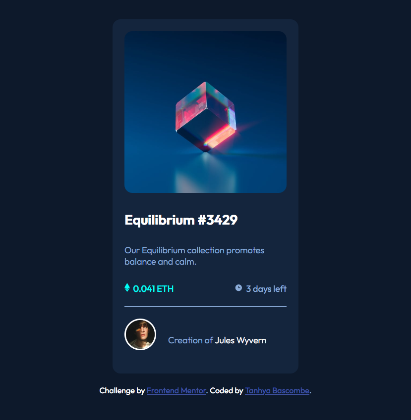

# Frontend Mentor - NFT preview card component solution

This is a solution to the [NFT preview card component challenge on Frontend Mentor](https://www.frontendmentor.io/challenges/nft-preview-card-component-SbdUL_w0U). Frontend Mentor challenges help you improve your coding skills by building realistic projects.

## Table of contents

- [The challenge](#the-challenge)
- [Screenshot](#screenshot)
- [Links](#links)
- [Built with](#built-with)
- [What I learned](#what-i-learned)
- [Continued development](#continued-development)
- [Useful resources](#useful-resources)
- [Author](#author)

### The challenge

Users should be able to: 

- View the optimal layout depending on their device's screen size
- See hover states for interactive elements

### Screenshot



### Links

- Solution URL: [https://github.com/TanhyaB/nft-preview-card-component](https://github.com/TanhyaB/nft-preview-card-component)
- Live Site URL: [https://tanhyab.github.io/nft-preview-card-component/](https://tanhyab.github.io/nft-preview-card-component/)

### Built with

- Semantic HTML5 markup
- CSS
- Flexbox
- Mobile-first workflow

### What I learned

I'm finally getting to grips with the display property and relative value. I used this twice which made it easier to position and style the icons and avatar section.

```css
.container .header ul {
  display: flex;
  position: relative;
  justify-content: space-between;
  margin: 2rem 0 1.5rem 0;
  padding-bottom: 1.5rem;
  border-bottom: solid;
  border-width: 0.1rem;
}

.container .avatar-footer {
  display: flex;
  position: relative;
}
```

### Continued development

Working on projects and taking notes of my workflow, as I'm not sure what that is yet. I'll probably need to do a few more projects to see how I work through the projects.

Having a deeper understanding of the flexbox and grid properties and how to use this with media queries, as I still find that a challenge.

### Useful resources

- [https://css-tricks.com/snippets/css/a-guide-to-flexbox/](https://css-tricks.com/snippets/css/a-guide-to-flexbox/) - I'd recommend the CSS tricks website for all things CSS obviously! It helped me heaps with flexbox!

## Author

- Frontend Mentor - [https://www.frontendmentor.io/profile/TanhyaB)](https://www.frontendmentor.io/profile/TanhyaB)
